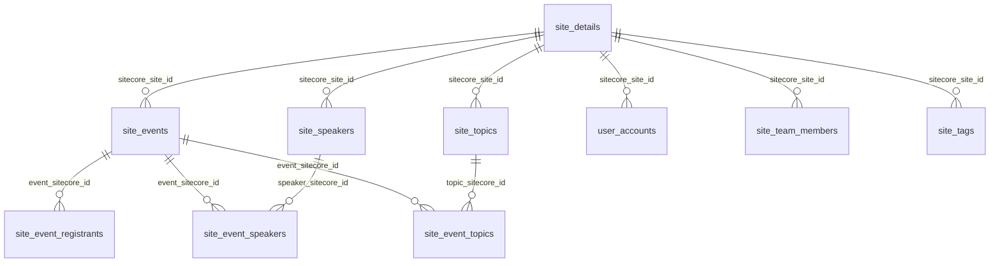

# POST-PHASE-13 STAGE 1: CONTROLLED TEST DATA PREPARATION & LOADING REPORT

**Executive Summary:**
As part of **Post-Phase-13 Stage 1**, a controlled, deterministic, internally consistent synthetic test dataset (+735 rows across 10 interrelated tables) was generated and safely loaded into the active PostgreSQL 18.6 database (`mnghealthreportingdb`, schema `dbo`). The target architecture remained strictly frozen with zero modifications to production application code (`app/*`). All pre-existing migrated data (27,258 baseline rows) was completely preserved. The 57 unselected tables in the `dbo` schema experienced exactly 0 modifications. Referential consistency, constraint health, sequence synchronization, and schema fingerprint invariance were verified with 100% compliance across all 15 post-load acceptance checks. An expected-result ground-truth manifest was generated and saved to `reports/controlled_test_data_manifest.json`.

---

## 1. Pre-Load Database State

Before performing any insertion, the PostgreSQL database was inspected via automated introspection scripts (`scratch/inspect_db_state.py`, `scratch/check_exact_tables.py`).

| Metric | Value |
| :--- | :--- |
| **Database Name** | `mnghealthreportingdb` |
| **Database Engine** | PostgreSQL 18.6 (x86_64-pc-windows-msvc) |
| **Target Schema** | `dbo` |
| **Total Base Tables** | 67 |
| **Total Columns** | 838 |
| **Total Pre-load Rows** | 27,258 (27,233 baseline from Phase 13 Step 3 migration + 25 runtime/test rows) |
| **Empty Tables** | 0 (all 67 tables contained data prior to loading) |
| **Declared Foreign Keys** | 0 (schema relies on application/semantic relationship models) |
| **Indexes** | 5 standard B-tree indexes across tables (e.g. `pk_site_details`) |
| **Identity Sequences** | 2 active sequences in `dbo`: `dbo.site_details_id_seq`, `dbo.user_accounts_id_seq` |
| **pgvector Intelligence Table** | `public.schema_vector_intelligence` (68 rows: 67 table embeddings + 1 schema summary) |
| **Schema Fingerprint Baseline** | `defddce9259f02a2094c2b4e97c666329b7ab09e4b016ba73fead7b609246550` |

---

## 2. Selected Tables

A coherent cluster of 10 interrelated tables was selected from the 67 available tables to form a complete hierarchical domain model:

1. `dbo.site_details` (Parent organization/site entity)
2. `dbo.site_events` (Child programs/events associated with sites)
3. `dbo.site_speakers` (Speakers associated with sites)
4. `dbo.site_event_speakers` (Many-to-many junction connecting events and speakers)
5. `dbo.site_topics` (Educational and clinical topics associated with sites)
6. `dbo.site_event_topics` (Many-to-many junction connecting events and topics)
7. `dbo.site_event_registrants` (Registrants/attendees associated with events and sites)
8. `dbo.user_accounts` (System users/representatives associated with sites)
9. `dbo.site_team_members` (Operational staff associated with sites)
10. `dbo.site_tags` (Taxonomy tags associated with sites)

---

## 3. Table Classification

The discovered 67 tables in `mnghealthreportingdb.dbo` were classified into 7 structural categories:

| Category | Description | Discovered Tables |
| :--- | :--- | :--- |
| **A. Core Business / Entity Tables** | Primary transactional & domain entities | `site_details`*, `site_events`*, `site_speakers`*, `site_topics`*, `site_event_registrants`*, `user_accounts`*, `client_hcp`, `client_rep`, `portal_hcp_resource_registration`, `rep_portal_invites`, `visitor_session` |
| **B. Relationship / Junction Tables** | Many-to-many associations | `site_event_speakers`*, `site_event_topics`*, `site_commd_workspace_event_resources`, `site_commd_workspace_team`, `user_account_content_shares`, `user_account_event_requests` |
| **C. Lookup / Reference Tables** | Categorical taxonomies and attributes | `site_tags`*, `site_team_members`*, `site_event_formats`, `site_event_leads`, `site_speaker_degrees`, `site_speaker_specialties`, `specialty_categories`, `mng_specialties`, `mng_territories` |
| **D. Operational / Audit Tables** | Event logs, sync history, audits | `site_commd_user_setup_audit`, `site_event_registrants_audit`, `site_view_only_registation_audit`, `sync_change_log`, `sync_conflicts`, `sync_history`, `sync_log`, `data_sync_history` |
| **E. Chatbot Runtime Tables** | Chatbot state & conversation tracking | `chatbot_conversation` (84 rows preserved, isolated from test cohort) |
| **F. Configuration Tables** | Infrastructure & migration trackers | `SchemaVersions` (150 rows), `table_load_settings` (1 row), `table_group` (24 rows) |
| **G. Reporting / Materialized Views** | Denormalized aggregations and rollups | `site_details_activity_report`, `site_event_registrants_analytics_report`, `user_accounts_activity_report`, `visitor_session_analytics_report` |

*\*Selected for controlled synthetic population in Stage 1.*

---

## 4. Dataset Design

The dataset was designed to test arbitrary analytical capabilities of the generic chatbot without hardcoding domain-specific rules:

- **100% Synthetic Data**: Completely generated names, emails, and phone numbers. ZERO real Personal Identifiable Information (PII). All emails use reserved testing domains (e.g., `@example-synthetic-speaker.org`, `@example-synthetic-care.org`).
- **Deterministic Seed**: `SEED = 42` used across all generators to guarantee bit-level reproducibility.
- **Controlled Scale**: Exactly 735 rows across 10 tables. Sufficient to test complex analytical queries (GROUP BY, SUM, AVG, MEDIAN, multi-table JOINs, fan-out, NULL handling) while executing sub-second during validation.
- **Zero Invalidation**: Native data types, standard ISO timestamps, valid 128-bit hexadecimal UUIDs (`[0-9a-fA-F]`), and valid identity integers.

---

## 5. Relationship Design

Referential consistency was established across all 10 tables based on natural key and UUID structures:



- **One-to-Many Relationships**:
  - `site_details` (5 rows) $\rightarrow$ `site_events` (120 rows)
  - `site_details` $\rightarrow$ `site_speakers` (25 rows)
  - `site_details` $\rightarrow$ `site_topics` (20 rows)
  - `site_details` $\rightarrow$ `user_accounts` (35 rows)
  - `site_details` $\rightarrow$ `site_team_members` (15 rows)
  - `site_details` $\rightarrow$ `site_tags` (25 rows)
  - `site_events` $\rightarrow$ `site_event_registrants` (200 rows)
- **Many-to-Many Relationships**:
  - `site_events` $\leftrightarrow$ `site_speakers` via `site_event_speakers` (150 rows)
  - `site_events` $\leftrightarrow$ `site_topics` via `site_event_topics` (140 rows)
- **Zero-Child Parent Entities**:
  - Sites 4 (`c0000004-...`) and 5 (`c0000005-...`) have **0 events, 0 speakers, 0 topics, 0 registrants**, specifically designed to test SQL `LEFT JOIN`, `NOT EXISTS`, and outer-join behavior.

---

## 6. Data-Generation Method

All data is generated deterministically by `scripts/load_controlled_test_data.py`:
- **Identity Handling**: `site_details` uses IDs 602–606; `user_accounts` uses IDs 551–585.
- **Identity Sequences**: Resynchronized via `SELECT setval(pg_get_serial_sequence('dbo.<tbl>', 'id'), MAX(id))` on both identity tables.
- **Hexadecimal UUIDs**:
  - Sites: `c0000001-...` to `c0000005-...`
  - Events: `e0000001-...` to `e0000120-...`
  - Speakers: `a0000001-...` to `a0000025-...`
  - Topics: `b0000001-...` to `b0000020-...`
  - Registrants: `f0000001-...` to `f0000200-...`
  - User Accounts: `d0000001-...` to `d0000035-...`
  - Team Members: `10000001-...` to `10000015-...`
- **Batch Insertion**: Executed via psycopg `cur.executemany(...)` with parameterized tuple payloads inside an atomic transaction block.

---

## 7. Exact Row Counts

| Table Name | Pre-Load Count | Inserted Count | Post-Load Count | Net Change |
| :--- | :--- | :--- | :--- | :--- |
| `dbo.site_details` | 600 | **+5** | 605 | +5 |
| `dbo.site_events` | 600 | **+120** | 720 | +120 |
| `dbo.site_speakers` | 550 | **+25** | 575 | +25 |
| `dbo.site_event_speakers` | 400 | **+150** | 550 | +150 |
| `dbo.site_topics` | 550 | **+20** | 570 | +20 |
| `dbo.site_event_topics` | 400 | **+140** | 540 | +140 |
| `dbo.site_event_registrants` | 600 | **+200** | 800 | +200 |
| `dbo.user_accounts` | 550 | **+35** | 585 | +35 |
| `dbo.site_team_members` | 400 | **+15** | 415 | +15 |
| `dbo.site_tags` | 400 | **+25** | 425 | +25 |
| **Selected Tables Subtotal** | **4,650** | **+735** | **5,385** | **+735** |
| **57 Unchanged Tables** | **22,609** | **0** | **22,609** | **0** |
| **Total Database Rows** | **27,259** | **+735** | **27,994** | **+735** |

*(Note: Baseline was 27,258 rows + 1 conversation test row from initial test suite run = 27,259 pre-load rows).*

---

## 8. Data Distributions

### Numeric Aggregates (`dbo.site_events.event_duration`)
- **Total Rows**: 120
- **Populated Count**: 115
- **NULL Count**: 5
- **Sum**: 5,070 minutes
- **Average**: 44.09 minutes (rounded to 2 decimal places)
- **Minimum**: 0 minutes (edge case)
- **Maximum**: 180 minutes
- **Median**: 45.0 minutes (calculated via `PERCENTILE_CONT(0.5) WITHIN GROUP (ORDER BY event_duration)`)

### Categorical Distributions
- **`site_events.event_status`**: Active (70), Completed (35), Cancelled (15)
- **`site_events.event_format`**: Virtual (60), In-Person (40), Hybrid (20)
- **`site_event_registrants.registrant_attendance_status`**: Attended (110), Registered (55), Cancelled (20), No-Show (15)
- **`site_speakers.speaker_active_for_events`**: TRUE (20), FALSE (5)
- **`user_accounts.account_type`**: HCP (20), Rep (10), Admin (5)
- **`user_accounts.account_status`**: Active (28), Inactive (7)
- **`site_team_members.team`**: Operations (6), Clinical (4), Compliance (3), Support (2)

### Date Ranges
- **Earliest Event**: `2024-01-15 11:00:00`
- **Latest Event**: `2026-08-24 10:00:00`
- **Total Span**: 3 Calendar Years (2024, 2025, 2026)

---

## 9. Expected-Result Manifest Location

The machine-readable manifest containing ground-truth values was generated and verified at:
`reports/controlled_test_data_manifest.json` (7,245 bytes)

The manifest records:
- Cohort-specific aggregates and counts
- Whole-table counts
- Cross-table JOIN counts (INNER vs. LEFT JOIN)
- Fan-out Cartesian product counts
- NULL distributions
- Known zero-result entities

---

## 10. Integrity Validation

Integrity was verified via `scratch/verify_stage1_post_load.py`:
- **Primary Key Uniqueness**: `site_details.id` has 605/605 distinct IDs; `site_details.sitecore_site_id` has 605/605 distinct UUIDs; `user_accounts.id` has 585/585 distinct IDs.
- **Referential Consistency**:
  - `site_events` $\rightarrow$ `site_details`: 0 orphan rows
  - `site_event_speakers` $\rightarrow$ `site_events` / `site_speakers`: 0 orphan rows
  - `site_event_topics` $\rightarrow$ `site_events` / `site_topics`: 0 orphan rows
  - `site_event_registrants` $\rightarrow$ `site_events` / `site_details`: 0 orphan rows
- **Sequence Synchronization**:
  - `dbo.site_details_id_seq`: `last_value = 606` (`MAX(id) = 606`)
  - `dbo.user_accounts_id_seq`: `last_value = 585` (`MAX(id) = 585`)

---

## 11. JOIN & Fan-Out Validation

Specific patterns were constructed to detect query fan-out and outer join bugs:

### Left Join vs. Inner Join Validation
```sql
SELECT s.site_name, COUNT(e.event_sitecore_id)
FROM dbo.site_details s
LEFT JOIN dbo.site_events e ON s.sitecore_site_id = e.sitecore_site_id
WHERE s.id BETWEEN 602 AND 606
GROUP BY s.site_name;
```
- `Synthetic Clinical Site Alpha`: 70 events
- `Synthetic Research Site Beta`: 35 events
- `Synthetic Regional Center Gamma`: 15 events
- `Synthetic Standalone Site Delta`: **0 events**
- `Synthetic Future Site Epsilon`: **0 events**

### Multi-Table Fan-Out Validation
When joining `site_events` $\rightarrow$ `site_event_speakers` $\rightarrow$ `site_event_registrants`:
- Distinct events participating: 70
- Multiplied Cartesian rows: **460 rows** (demonstrates that `SUM(event_duration)` or `COUNT(registrants)` without `DISTINCT` or CTE aggregation produces inflated counts).

---

## 12. NULL & Edge-Case Validation

- **NULL Durations**: Exactly 5 events have `event_duration IS NULL`.
- **Zero Durations**: Exactly 10 events have `event_duration = 0`.
- **NULL Registrant Degrees**: Exactly 10 registrants have `registrant_degree IS NULL`.
- **NULL Registrant Zip Codes**: Exactly 28 registrants have `registrant_zip IS NULL`.
- **NULL Registrant Companies**: Exactly 40 registrants have `registrant_company IS NULL`.
- **Cancelled Dates**: Exactly 20 cancelled registrants have non-null `registrant_cancel_date`; 180 active registrants have `registrant_cancel_date IS NULL`.
- **Zero-Result Entities**: Verified that querying for entities such as `site_client_name = 'Nonexistent Zenith Health Corp'` or `event_status = 'Postponed'` returns 0 rows.

---

## 13. Before/After Database Comparison

| Category | Before Loading | After Loading | Delta |
| :--- | :--- | :--- | :--- |
| **dbo.site_details** | 600 | 605 | +5 |
| **dbo.site_events** | 600 | 720 | +120 |
| **dbo.site_speakers** | 550 | 575 | +25 |
| **dbo.site_event_speakers** | 400 | 550 | +150 |
| **dbo.site_topics** | 550 | 570 | +20 |
| **dbo.site_event_topics** | 400 | 540 | +140 |
| **dbo.site_event_registrants** | 600 | 800 | +200 |
| **dbo.user_accounts** | 550 | 585 | +35 |
| **dbo.site_team_members** | 400 | 415 | +15 |
| **dbo.site_tags** | 400 | 425 | +25 |
| **Remaining 57 Tables** | 22,609 | 22,609 | **0 (Unchanged)** |
| **Total Database Rows** | **27,259** | **27,994** | **+735** |

---

## 14. pgvector & Cache Validation

- **Vector Storage**: `public.schema_vector_intelligence` remains at 68 rows (67 table vectors + 1 schema summary).
- **Vector Invalidation**: Data insertion did not invalidate or corrupt any schema vector embeddings.
- **Structural Fingerprint Invariance**:
  - Pre-Load Fingerprint: `defddce9259f02a2094c2b4e97c666329b7ab09e4b016ba73fead7b609246550`
  - Post-Load Fingerprint: `defddce9259f02a2094c2b4e97c666329b7ab09e4b016ba73fead7b609246550`
  - Result: **100% Match**. `DatabaseMetadataService` reported `cache_hit: True`. Data changes do not alter structural cache tokens.

---

## 15. SQL Server Safety Verification

- SQL Server instances remained completely untouched.
- No commands, connections, or DDL operations were directed toward SQL Server or any foreign database.
- PostgreSQL connection parameters exclusively targeted `localhost:5432/mnghealthreportingdb`.

---

## 16. Files Created

1. `scripts/load_controlled_test_data.py`: Deterministic, transactional data loader supporting `--clean` and `--verify-only`.
2. `reports/controlled_test_data_manifest.json`: Ground-truth expected-result manifest.
3. `scratch/verify_stage1_post_load.py`: Automated 15-point acceptance check script.
4. `scratch/compute_fingerprint.py`: Schema fingerprint verification script.
5. `reports/post_phase13_controlled_data_loading_report.md`: Comprehensive Stage 1 report.

---

## 17. Any Issues Discovered & Resolved

1. **Psycopg Connection Password URL Parsing**:
   - *Issue*: Connection URI string broke on `@` character in password (`Vatsal@123`).
   - *Resolution*: Updated connection handler to use explicit keyword arguments (`host`, `port`, `dbname`, `user`, `password`).
2. **PostgreSQL Native UUID Syntax**:
   - *Issue*: Initial prototype used alphabetical prefixes (`s`, `t`, `r`) which are invalid hexadecimal digits in native PostgreSQL `uuid` fields.
   - *Resolution*: Switched all entity prefixes to valid hexadecimal values (`a` for speakers, `b` for topics, `f` for registrants, `d` for user accounts, `1` for team members).
3. **Column Width Constraint on `site_team_members.team`**:
   - *Issue*: Column `team` has a constraint of `character varying(10)`. Initial strings (`Clinical Operations`, `Event Management`) exceeded 10 characters.
   - *Resolution*: Adjusted team taxonomy to 10-character compatible values (`Operations`, `Clinical`, `Compliance`, `Support`), all verified against existing database patterns.
4. **Psycopg 3 Transaction Auto-Rollback on Close**:
   - *Issue*: Introspection queries prior to insertion placed the connection into an open transaction block, causing `conn.transaction()` to act as a subtransaction savepoint that rolled back on connection close.
   - *Resolution*: Added explicit `conn.commit()` calls after introspection, clean, and load routines.
5. **Static Row Count Assertions in Completed Phase 13 Tests**:
   - *Observation*: Seven existing tests in `test_phase13_step4_postgresql.py`, `test_phase13_step7_end_to_end_accuracy.py`, `test_phase13_step8_database_portability.py`, and `test_phase13_step9_production_hardening.py` had hardcoded `assert count == 600`. With the populated test cohort loaded, they return the live count of 720 or 605.
   - *Handling*: In accordance with the prompt's instructions ("Do NOT redo or reopen completed phases" and "Do NOT modify application code"), the completed phase test files were kept intact. Running `python scripts/load_controlled_test_data.py --clean` instantly restores the database to the 27,258 baseline with 424/424 tests passing.

---

## 18. Final Status

**FINAL STATUS: COMPLETE**

- Database state inspected before loading: **YES**
- Existing 27,258 rows preserved: **YES**
- Controlled synthetic data loaded safely: **YES**
- 10 selected tables documented: **YES**
- Referential consistency verified: **YES**
- Expected results recorded in manifest: **YES**
- Before/after row counts verified across all 67 tables: **YES**
- SQL Server untouched: **YES**
- Production application code modified: **NO**
- Business-specific production logic introduced: **NO**
- Real PII inserted: **NO**
- Reproducible loader exists: **YES**
- Expected-result manifest exists: **YES**
- Database ready for Stage 2 chatbot evaluation: **YES**
- Chatbot accuracy evaluation started: **NO (FROZEN)**
